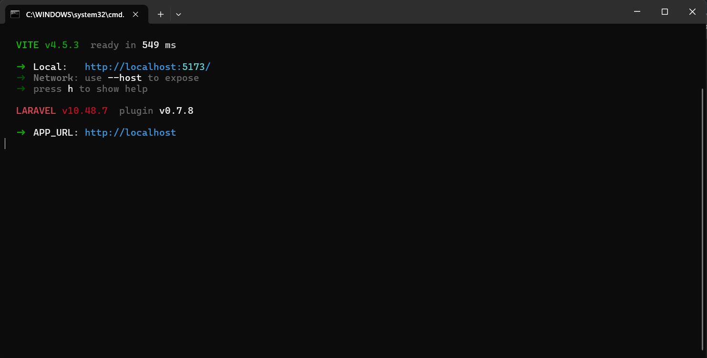
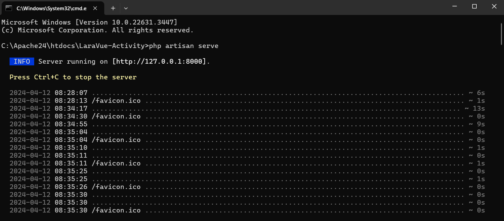
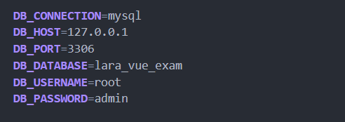
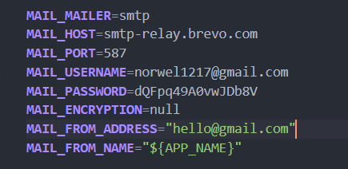
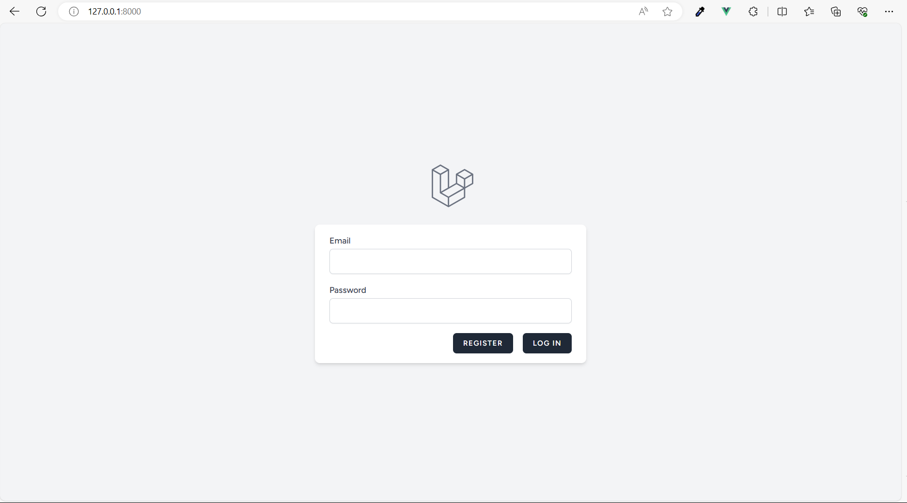
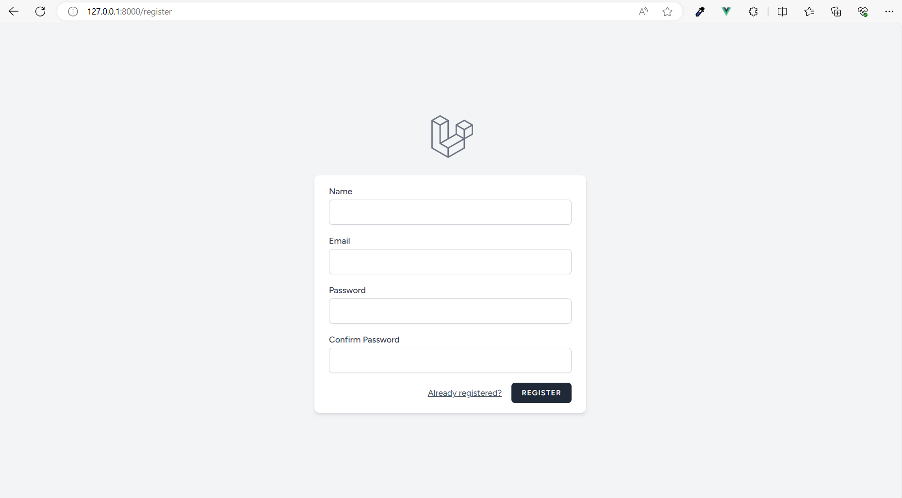
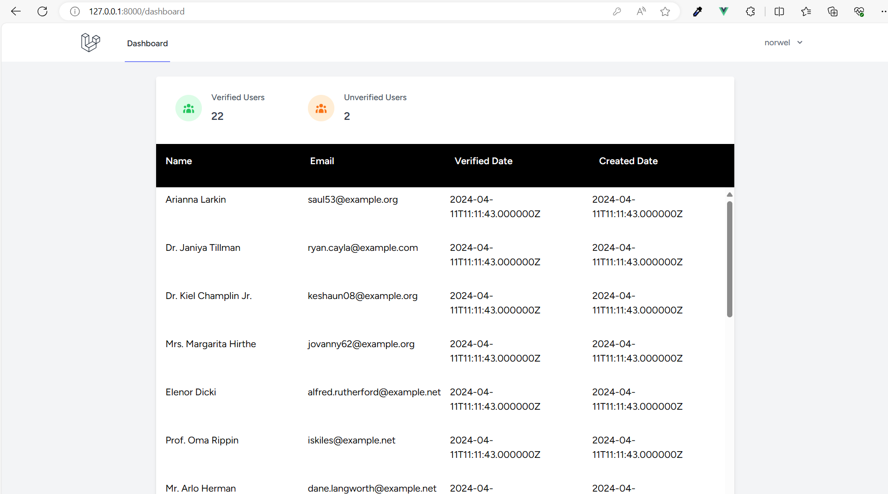

# Laravel 10 with Vue 3, Inertia.js, PHP 8, and Papercut SMPT

## Installation

1. Clone the repository:
    ```bash
   git clone <repository_url>
   cd project-directory
   composer install
   npm install
   copy .env.example .env
   php artisan key:generate
   php artisan migrate

- npm run dev use different console
- 
- php artisan serve use different console
- 
## ENV 
1. Database Configuration:
    ```
    DB_CONNECTION=mysql
    DB_HOST=127.0.0.1
    DB_PORT=3306
    DB_DATABASE=lara_vue_exam
    DB_USERNAME=root
    DB_PASSWORD=admin

- 

2. ENV Configuration:
    ```
   MAIL_MAILER=smtp
   MAIL_HOST=smtp-relay.brevo.com
   MAIL_PORT=587
   MAIL_USERNAME=norwel1217@gmail.com
   MAIL_PASSWORD=dQFpq49A0vwJDb8V
   MAIL_ENCRYPTION=null
   MAIL_FROM_ADDRESS="hello@gmail.com"
   MAIL_FROM_NAME="${APP_NAME}"

- 

## OUTPUT
- Login Page
- 

- Register Page
- 

- Dashboard Page
- 

## Additional Information

- **Laravel Documentation:** [https://laravel.com/docs/10.x](https://laravel.com/docs/10.x)
- **Vue 3 Documentation:** [https://v3.vuejs.org/guide/introduction.html](https://v3.vuejs.org/guide/introduction.html)
- **Inertia.js Documentation:** [https://inertiajs.com/](https://inertiajs.com/)
- **Brevo SMTP:** [https://www.brevo.com/](https://www.brevo.com/)
